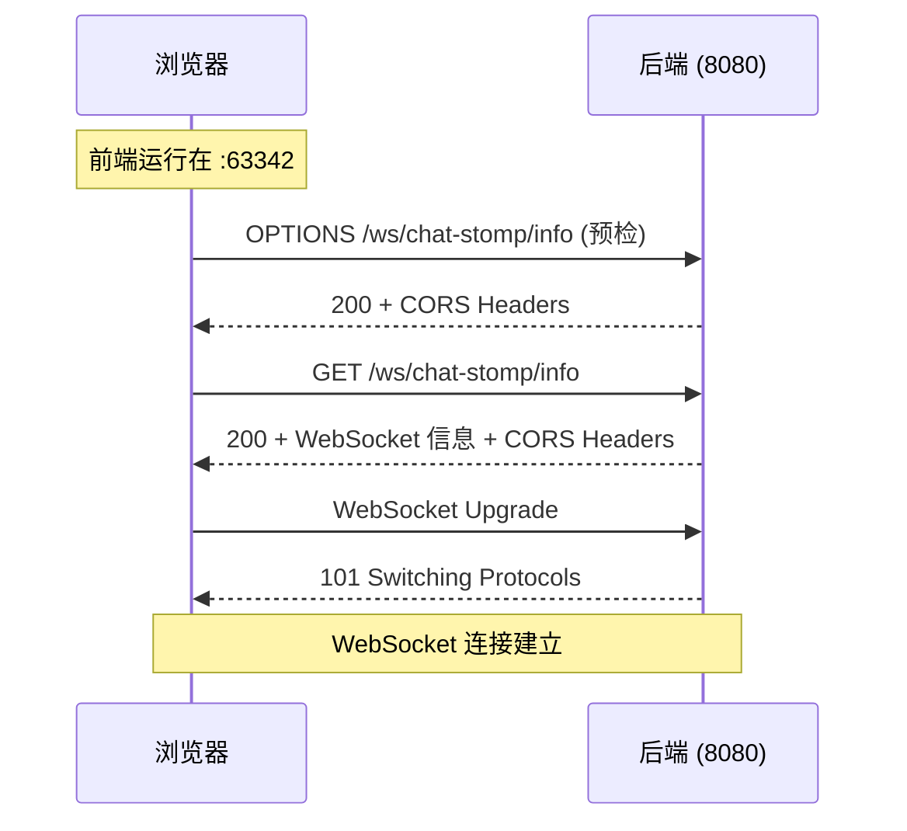

# CORS 跨域问题解决方案

## 🔴 问题描述

当前端页面从 IDE 内置服务器（如 `http://localhost:63342`）访问后端 WebSocket 服务（`http://localhost:8080`）时，浏览器会报以下错误：

```
Access to XMLHttpRequest at 'http://localhost:8080/ws/chat-stomp/info?t=1761904006347' 
from origin 'http://localhost:63342' has been blocked by CORS policy: 
No 'Access-Control-Allow-Origin' header is present on the requested resource.
```

## 🎯 问题原因

这是浏览器的**同源策略（Same-Origin Policy）**导致的：

- **前端地址**：`http://localhost:63342` (IDEA 内置服务器)
- **后端地址**：`http://localhost:8080` (Spring Boot 应用)
- **问题**：协议、域名相同，但**端口不同**，被浏览器视为跨域请求

SockJS 在建立 WebSocket 连接前，会先发送 HTTP 请求获取连接信息（`/info` 端点），这个 HTTP 请求受到 CORS 限制。

## ✅ 解决方案

我已经实施了**双层 CORS 配置**，确保所有 WebSocket 相关请求都能通过：

### 1️⃣ STOMP 端点级别的 CORS 配置

**文件**：`src/main/java/com/yihu/agent/config/StompWebSocketConfig.java`

```java
@Override
public void registerStompEndpoints(StompEndpointRegistry registry) {
    registry.addEndpoint("/ws/chat-stomp")
            // ✅ 使用 setAllowedOriginPatterns("*") 允许所有来源
            .setAllowedOriginPatterns("*")
            .withSockJS();
}
```

**关键点**：
- 使用 `setAllowedOriginPatterns("*")` 而不是 `setAllowedOrigins("*")`
- `setAllowedOriginPatterns` 支持通配符，可以匹配任意端口的 localhost

### 2️⃣ 全局 Web MVC 的 CORS 配置

**文件**：`src/main/java/com/yihu/agent/config/WebMvcConfig.java`（新增）

```java
@Configuration
public class WebMvcConfig implements WebMvcConfigurer {
    
    @Override
    public void addCorsMappings(CorsRegistry registry) {
        registry.addMapping("/**") // 对所有路径生效
                .allowedOriginPatterns("*") // 允许所有来源
                .allowedMethods("GET", "POST", "PUT", "DELETE", "OPTIONS")
                .allowedHeaders("*")
                .exposedHeaders("*")
                .allowCredentials(true)
                .maxAge(3600);
    }
}
```

**作用**：
- 为所有 HTTP 请求（包括 SockJS 的 `/info` 请求）添加 CORS 支持
- 允许所有来源、所有方法、所有请求头

## 🚀 使用步骤

### 1. 重启后端应用

修改配置后，**必须重启** Spring Boot 应用才能生效：

```bash
# 停止当前运行的应用
# 然后重新启动
mvn spring-boot:run
```

或在 IDEA 中点击重启按钮。

### 2. 测试连接

#### 方法 A：通过后端服务访问（推荐）
访问：`http://localhost:8080/index.html`

✅ **优点**：同源访问，不存在 CORS 问题

#### 方法 B：通过 IDEA 内置服务器访问
访问：`http://localhost:63342/...`

✅ **优点**：修改文件后自动刷新
⚠️ **注意**：需要后端正确配置 CORS

### 3. 验证 CORS 配置

打开浏览器开发者工具（F12），查看网络请求：

**成功的标志**：
```
Request URL: http://localhost:8080/ws/chat-stomp/info?t=...
Request Method: GET
Status Code: 200 OK

Response Headers:
  Access-Control-Allow-Origin: http://localhost:63342
  Access-Control-Allow-Credentials: true
```

## 🔍 调试技巧

### 检查 CORS 响应头

在浏览器控制台（F12 → Network 标签）中查看请求：

1. 找到 `/ws/chat-stomp/info` 请求
2. 查看 **Response Headers**，应该包含：
   ```
   Access-Control-Allow-Origin: *
   或
   Access-Control-Allow-Origin: http://localhost:63342
   ```

### 查看 OPTIONS 预检请求

浏览器可能会先发送 OPTIONS 请求（预检请求）：

```
Request Method: OPTIONS
Request URL: http://localhost:8080/ws/chat-stomp/info
```

这个请求也必须返回正确的 CORS 头，否则后续的 GET/POST 请求不会发送。

## ⚠️ 常见问题

### 问题 1：修改配置后仍然报错

**原因**：浏览器缓存了旧的 CORS 响应

**解决**：
1. 清除浏览器缓存
2. 或使用无痕模式（Ctrl+Shift+N）
3. 或硬刷新（Ctrl+F5）

### 问题 2：OPTIONS 请求返回 403 或 404

**原因**：Spring Security 拦截了 OPTIONS 请求

**解决**：如果启用了 Spring Security，需要配置：
```java
http.cors().and()...
```

### 问题 3：仅 STOMP 配置不生效

**原因**：SockJS 的 `/info` 端点是普通 HTTP 请求，不受 STOMP 端点配置影响

**解决**：必须同时配置全局 CORS（WebMvcConfig）

## 📊 完整的请求流程



## 🔐 生产环境配置

⚠️ **重要**：当前配置允许所有来源访问（`*`），仅适用于**开发环境**。

**生产环境**应该设置具体的域名：

```java
// StompWebSocketConfig.java
registry.addEndpoint("/ws/chat-stomp")
        .setAllowedOriginPatterns(
            "https://yourdomain.com",
            "https://www.yourdomain.com"
        )
        .withSockJS();

// WebMvcConfig.java
registry.addMapping("/**")
        .allowedOriginPatterns(
            "https://yourdomain.com",
            "https://www.yourdomain.com"
        )
        .allowedMethods("GET", "POST", "PUT", "DELETE", "OPTIONS")
        .allowCredentials(true);
```

## ✅ 验证清单

确保以下所有项都正确配置：

- [ ] `StompWebSocketConfig.java` 中添加了 `.setAllowedOriginPatterns("*")`
- [ ] 创建了 `WebMvcConfig.java` 并配置了全局 CORS
- [ ] 重启了后端应用
- [ ] 清除了浏览器缓存
- [ ] 浏览器控制台中 `/info` 请求返回 200
- [ ] 响应头中包含 `Access-Control-Allow-Origin`
- [ ] STOMP 连接成功建立

## 🎉 成功标志

当所有配置正确时，浏览器控制台会显示：

```javascript
SockJS connection opened
STOMP Debug: connected to server ...
✅ STOMP 连接成功！
```

并且不再有任何 CORS 相关的错误信息。

## 📞 仍然有问题？

如果按照以上步骤操作后仍然失败，请提供：
1. 完整的浏览器控制台错误信息
2. Network 标签中 `/info` 请求的完整 Request/Response Headers
3. 后端控制台的日志输出
4. Spring Boot 版本号

