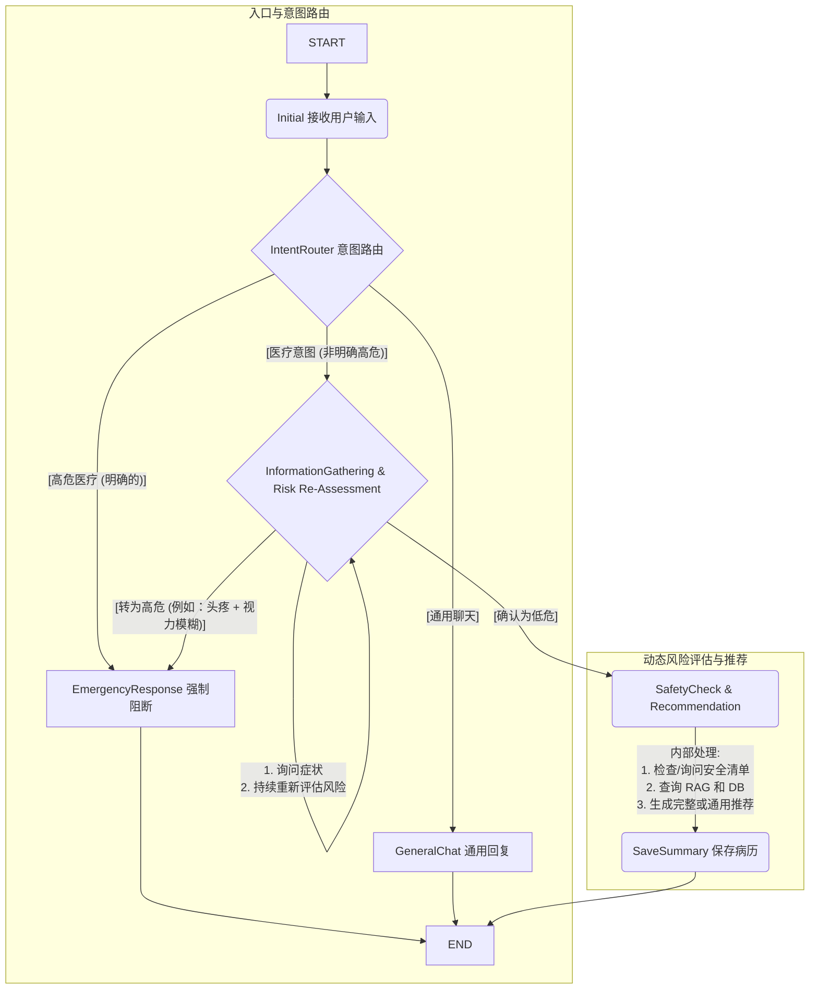

# HealthCare AI 对话功能 - V1 开发手册

## 1. 概述

本文档旨在为 HealthCare 项目第一版 AI 对话功能的开发提供详细指引。V1 版本将基于 Spring Boot 技术栈，集成 `LangChain4j` 与 `LangGraph4j`，通过 WebSocket (STOMP) 协议实现一个具备初步医疗咨询、风险评估和多轮对话能力的 AI 助手。

## 2. 技术架构

整体架构分为前端、WebSocket接入层、对话服务层和数据层，各层之间通过明确定义的接口进行通信。

```
┌─────────────────────────────────────────────┐
│            前端 (WebSocket Client)           │
└──────────────────┬──────────────────────────┘
                   │ STOMP over WebSocket
┌──────────────────▼──────────────────────────┐
│     WebSocket层 (AiChatController)          │
└──────────────────┬──────────────────────────┘
                   │
┌──────────────────▼──────────────────────────┐
│   对话服务层 (HealthCareAgentService)       │
│   ├─ LangGraph4j 状态机                     │
│   ├─ LangChain4j LLM集成                    │
│   └─ 内存管理                               │
└──────────────────┬──────────────────────────┘
                   │
┌──────────────────▼──────────────────────────┐
│        数据层 (内存存储)                    │
│   ├─ ChatMemory (对话历史)                  │
│   └─ UserProfile (用户档案)                 │
└─────────────────────────────────────────────┘
```

## 3. 核心流程 - LangGraph 状态机

对话的核心逻辑由 LangGraph4j 状态机驱动，确保对话流程的健壮性和可扩展性。状态机流程如下：



**状态节点说明:**
-   **`Initial`**: 接收用户首次输入，进行初步处理。
-   **`IntentRouter`**: 意图路由核心。判断用户输入属于高危医疗、普通医疗意图还是通用闲聊。
-   **`EmergencyResponse`**: 紧急情况处理节点。当识别到高危意图（如“胸痛”、“呼吸困难”）时，立即中断对话，并给出紧急就医建议。
-   **`GeneralChat`**: 处理与医疗无关的通用对话。
-   **`InformationGathering & Risk Re-Assessment`**: 结构化追问与动态风险评估。对于非明确高危的医疗意图，通过多轮对话收集详细信息，并在每一轮对话后重新评估风险等级。
-   **`SafetyCheck & Recommendation`**: 安全检查与建议生成。在确认为低风险后，执行安全问题清单检查，并结合知识库（未来扩展）生成处理建议。
-   **`SaveSummary`**: 对话结束后，对本次咨询进行总结，并保存至用户健康档案。
-   **`END`**: 流程结束。

## 4. 核心组件实现

#### 4.1. LangChain4j 集成
-   **ChatLanguageModel**: 优先使用 `langchain4j-open-ai` 集成 OpenAI GPT-4 模型，后期可按需切换为其他本地或云端模型。
-   **ChatMemory**: 采用 `MessageWindowChatMemory` 实现基于内存的对话历史管理，建议保留最近10轮对话。
-   **Prompt模板**: 在 `resources/prompts/` 目录下创建系统级提示词 (`system-prompt.txt`)，定义医疗助手的角色、能力边界和沟通风格。
-   **工具集成**: V1 版本暂不集成外部工具，但架构上为未来扩展RAG、药品查询等功能预留接口。

#### 4.2. WebSocket 通信
复用项目现有的STOMP配置，为AI对话功能分配新的端点。
-   **用户订阅端点**: `/user/queue/ai-reply` (服务器向客户端发送消息)
-   **用户发送端点**: `/app/chat/ai` (客户端向服务器发送消息)
-   **消息格式** (参考):
    ```json
    {
      "userId": "user123",
      "message": "我拉肚子了",
      "sessionId": "session-uuid-abcde"
    }
    ```

#### 4.3. 内存与数据模型
V1 版本所有数据（对话历史、用户档案）均存储在内存中，应用重启后数据将丢失。
-   **对话记忆**: `Map<String, ChatMemory> sessionMemories = new ConcurrentHashMap<>();`
-   **用户健康档案**: `Map<String, UserHealthProfile> userProfiles = new ConcurrentHashMap<>();`
-   **数据模型 (`UserHealthProfile.java`)**:
    ```java
    class UserHealthProfile {
        String userId;
        String age, gender;
        List<String> allergies;        // 过敏史
        boolean isPregnant;            // 孕期
        List<String> chronicDiseases;  // 慢性病
        List<ConsultationRecord> history; // 历史咨询记录
    }
    ```

## 5. 项目结构

新增的AI功能相关文件将统一放置在 `com.yihu.agent.ai` 包下。

```
src/main/java/com/yihu/agent/
├── ai/
│   ├── service/
│   │   ├── HealthCareAgentService.java      # 核心服务，调用Graph
│   │   ├── ChatMemoryService.java           # 记忆管理
│   │   └── UserProfileService.java          # 档案管理
│   ├── graph/
│   │   ├── AgentState.java                  # 状态定义
│   │   ├── HealthCareGraph.java             # LangGraph构建与执行
│   │   └── nodes/                           # 各个状态节点实现
│   │       ├── InitialNode.java
│   │       ├── IntentRouterNode.java
│   │       ├── EmergencyResponseNode.java
│   │       ├── InformationGatheringNode.java
│   │       ├── SafetyCheckNode.java
│   │       └── SaveSummaryNode.java
│   ├── config/
│   │   └── LangChainConfig.java             # LLM及ChatMemory配置
│   └── model/
│       ├── UserHealthProfile.java
│       ├── ConsultationRecord.java
│       └── ChatRequest.java / ChatResponse.java
├── controller/
│   └── AiChatController.java                # 新增的WebSocket控制器
└── resources/
    ├── application.properties               # 添加AI相关配置
    └── prompts/
        └── system-prompt.txt                # 系统提示词

Front/
└── ai-chat.html                             # AI对话功能测试页面
```

## 6. 依赖配置

在 `pom.xml` 文件中添加以下核心依赖：
```xml
<!-- LangChain4j -->
<dependency>
    <groupId>dev.langchain4j</groupId>
    <artifactId>langchain4j</artifactId>
    <version>0.32.0</version>
</dependency>
<dependency>
    <groupId>dev.langchain4j</groupId>
    <artifactId>langchain4j-open-ai</artifactId>
    <version>0.32.0</version>
</dependency>

<!-- LangGraph4j -->
<dependency>
    <groupId>org.bsc.langgraph4j</groupId>
    <artifactId>langgraph4j-core-jdk8</artifactId>
    <version>0.1.0-beta.1</version>
</dependency>
```
*注：请根据实际情况选用最新的稳定版本。*

## 7. 环境配置

在 `application.properties` 文件中添加相关配置项：
```properties
# OpenAI配置
langchain4j.openai.chat-model.api-key=${OPENAI_API_KEY}
langchain4j.openai.chat-model.model-name=gpt-4
langchain4j.openai.chat-model.temperature=0.7

# 对话记忆配置
healthcare.chat.memory.max-messages=10
healthcare.chat.session-timeout=30m

# 高危关键词（可外置到数据库或配置中心）
healthcare.emergency.keywords=胸痛,心脏疼,呼吸困难,大出血,昏迷,窒息,中风,失明
```

## 8. 开发阶段规划

**第一阶段 (MVP)**:
1.  完成 `LangChainConfig`，实现与 OpenAI 的基础通信。
2.  创建 `AiChatController`，打通 WebSocket -> Service -> LangChain 的基础链路。
3.  实现基于内存的 `ChatMemoryService`。
4.  构建一个简化的 LangGraph（3个节点：Initial -> GeneralChat -> END），验证流程可以跑通。

**第二阶段**:
5.  按照设计完整实现 LangGraph 状态机的所有节点和路由逻辑。
6.  实现风险评估逻辑，包括高危关键词匹配和动态评估。
7.  实现 `UserProfileService`，完成用户档案的内存存储和读取。

**第三阶段**:
8.  创建 `ai-chat.html` 前端页面，优化交互体验（如“正在思考...”状态、紧急警告突出显示等）。
9.  进行全面的功能测试、压力测试和异常流程调试。

## 9. 关键决策

-   **LLM选择**: V1 版本使用 OpenAI GPT-4 模型以保证对话质量和开发效率。
-   **状态持久化**: V1 版本所有状态均在内存中，不进行持久化。
-   **并发处理**: 核心数据结构（如`sessionMemories`）使用 `ConcurrentHashMap` 保证线程安全。
-   **错误处理**: 对于 LLM 调用失败、超时等情况，需要设计合理的降级策略（如返回“服务繁忙，请稍后再试”）。
